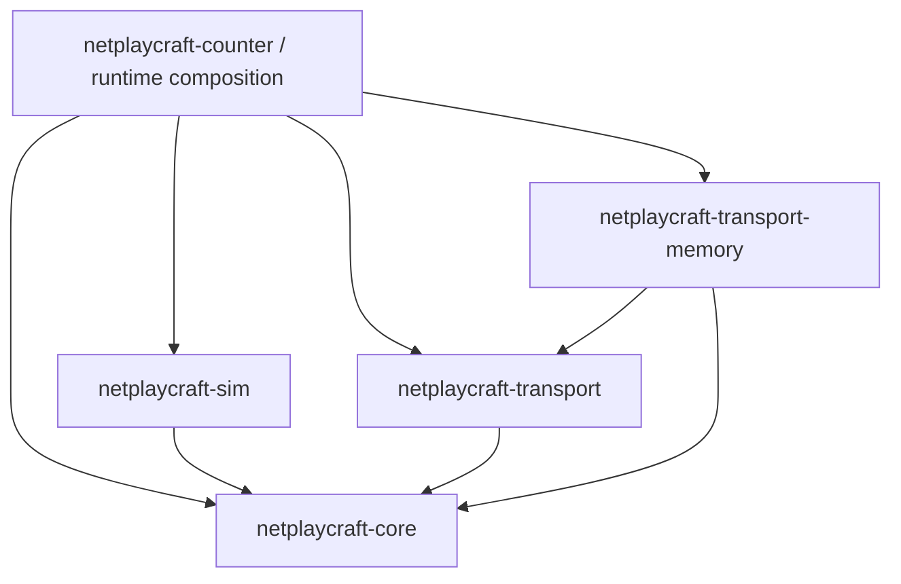

# Architecture

Status: milestone 0 and the milestone 1 local prototype. All APIs are provisional.
The [founding plan](plan.md) is the product direction; this document describes the
implemented boundaries and what remains unproven.

## Invariant

```text
Game = Simulation + Synchronization Strategy + Authority
     + Transport + Persistence + Runtime
```

Topology describes connections, not authority. These concerns are composed by
an application; they are not a rigid stack of crate dependencies.

The current prototype proves that counter rules can run directly, replay an
ordered command history, and reconstruct from an in-memory checkpoint plus a
suffix. The same rules run in two independent simulation instances connected by
encoded messages. Browser/native networking and durable backend swaps are still
future validation, not capabilities claimed by this prototype.

## Dependency graph

Arrows mean “depends on.” Every dependency is local; there are no third-party
Rust dependencies in this milestone.



Inside the example, `game` uses only core/simulation contracts; `protocol` knows
command data; `session` implements authority and replay without I/O; `lib.rs`
composes sessions with transport and drives virtual time. The CLI prints results.

Future rollback, lockstep, and snapshot strategies should depend inward on these
contracts. Browser, native, cloud, engine, and storage adapters also depend inward.
Do not make portable algorithms import browser APIs, WebRTC, WebTransport, S3,
Cloudflare, Bevy, or Tokio. Core and simulation currently use `no_std`; transport
uses `Vec` and the memory adapter uses standard collections and `Rc<RefCell<_>>`.
No unconditional Send/Sync bounds force browser integrations into threading.

## Public contracts

`netplaycraft-core` provides Tick(u64), PeerId(u64), PlayerId(u8), Sequence(u64),
ChannelId(u8), Checksum(u64), and Command<T> { player, payload }. Their widths are
provisional and do not promise global identity, authentication, or an eventual
library wire format. SessionId is deferred until multiple sessions need routing.

`netplaycraft-sim` provides three independent capabilities:

```rust,ignore
trait Simulation {
    type Input;
    type Error;
    fn tick(&mut self, tick: Tick, inputs: &[Self::Input]) -> Result<(), Self::Error>;
}
trait Snapshotable {
    type Snapshot;
    type Error;
    fn snapshot(&self) -> Self::Snapshot;
    fn restore(&mut self, snapshot: &Self::Snapshot) -> Result<(), Self::Error>;
}
trait Checksummed {
    fn checksum(&self) -> Checksum;
}
```

Simulation does not imply determinism for every future game. A deterministic
strategy requires deterministic inputs, ordering, and transitions. Tick/restore
errors must leave state unchanged. Checksum and snapshot representations remain
owned by the game. No serialization, Clone, or snapshot requirement is imposed
on every Simulation implementation.

`netplaycraft-transport::Transport` exposes an associated Error, delivery(channel),
send(peer, channel, bytes), and poll() returning Connected, Disconnected, or Message.
Sending and polling do not block. Successful send means accepted, not delivered.
Adapters own connection establishment and execution machinery outside this trait.
Only `Delivery::Unreliable` is implemented now. ReliableOrdered,
ReliableUnordered, and UnreliableSequenced should be added as exercised semantics,
with explicit capabilities and unsupported-channel errors, not fictional guarantees.

## Simulation and timelines

The counter has count:i32, next_tick:Tick, and turn:Sequence. Player 0 starts;
accepted Increment/Decrement commands alternate players. One step accepts zero
or one command. Empty ticks still advance simulation time. Integer overflow and
invalid turns return errors without changing state.

`next_tick = N` means the state immediately before step N, after all steps less
than N. A frame contains the checksum after its tick is applied. The runtime
calls the authority every 20 virtual milliseconds (50 Hz); the replica advances
only through contiguous frames and can catch up several ticks per network pump.
Network time, authoritative simulation progress, and replica progress are distinct.
There is no render or predicted timeline yet, so no universal clock struct with
placeholder values. FPS/rollback strategies must expose their actual timelines.

## Authority, netcode, and topology

The example Host binds two PeerIds to PlayerIds, accepts a proposal for the
current turn, assigns its simulation tick, validates through the same counter
rules, and retains an authoritative frame. Authority placement is not encoded
in Counter. A remote payload cannot choose its own player identity.

Replica accepts frames only from its configured authority, buffers bounded
out-of-order frames, ignores already-applied retransmissions, and applies a
contiguous prefix. It verifies every frame's checksum before committing that
transition. No rollback, prediction, election, consensus, or host migration is
implemented. A peer identity from a transport is a trusted binding in this test
harness; production authentication/session admission is not supplied.

The reference application resends unacknowledged frames and repeats pending
proposals. Cumulative ACKs identify the replica's next required tick; duplicate
and reordered ACKs cannot regress progress. This deliberately small policy
exercises loss without adding a reliable transport implementation. It resends
whole suffixes and retains at most 256 frames. At capacity it returns HistoryFull;
it is not an indefinitely running room or a congestion-control algorithm.

The in-memory adapter constructs a pair, not a generalized topology framework.
Transport addresses peers; it has no client/server role. More complex topology
should be introduced with the first use that needs it.

## Simulated transport

`SimulatedNetwork::pair(peers, conditions, seed)` returns a controller and two
MemoryTransport endpoints. The controller advances virtual time explicitly.
There are no threads, sleeps, system clocks, or OS random sources.

NetworkConditions configures latency, additive uniform jitter, loss, duplication,
and extra delay to induce reordering. Rates are integer basis points out of
10,000. For a fixed seed and identical send/advance calls, delivery and statistics
repeat exactly. Ties preserve enqueue order. Packets sent at zero latency are
available after the next advance (which can use Duration::ZERO), not during poll.
A disconnect removes queued traffic and emits events; reconnection is deferred.

The adapter bounds packet payloads at 1,200 bytes and total queued events/packets
at 4,096, reserving room for duplication. Backpressure is an error; the example
fails visibly on it. These are adapter/demo limits, not universal core constants.
NetworkStats exposes accepted sends, fault-dropped originals, generated duplicates,
and delivered packets. A delivered count includes duplicates and can exceed
original sends. Pending traffic can remain when the demo converges.

## Persistence and runtime

Snapshotable enables the recovery *operation*, not a durable store. Tests restore
an in-memory checkpoint and replay frames after it, including empty ticks. The
current frame index is its tick; accepted command turn numbers are separate.
Future journal Sequence and checkpoint watermarks must explicitly define what
record prefix was committed. Do not silently equate all three counters.

No SnapshotStore/JournalStore, async trait dependency, policy builder, OPFS,
IndexedDB, SQLite, or S3 implementation exists yet. Introduce memory-backed stores
when exercising append/read/commit semantics, then OPFS and later object stores.
Store session ownership and authority identity outside serialized game rules.
Atomic checkpoint/journal publication and browser crash recovery need explicit
contracts before durability claims. See [ADR 003](adr/003-persistence.md).

The runtime composes and drives the pieces. The CLI uses virtual time rather than
sleeping in real time. Browser callbacks or a native scheduler can later pump the
same strategies. WASM compilation checks portability; it does not validate browser
execution, cross-runtime determinism, or WebRTC behavior.

## Decisions and next validation

- [ADR 001](adr/001-capabilities.md): separate simulation, snapshot, and checksum
  capabilities; keep example synchronization local until a second strategy exists.
- [ADR 002](adr/002-transport-runtime.md): nonblocking semantic transport; browser
  adapter/signaling mechanism and reliable channel negotiation remain open.
- [ADR 003](adr/003-persistence.md): separate checkpoint and journal intent;
  async technology, commit boundaries, and storage policy remain open.

Before adding WebRTC, agree on channel capability negotiation, send queue limits,
connection lifecycle, and adapter progress ownership. Then run the unchanged
counter in two tabs using native RTCPeerConnection, with replaceable signaling,
ICE/STUN/TURN configuration, and reliable/unreliable channels. Test disconnect and
reconnect semantics before generalizing the session API.

Avoid extracting Host/Replica into a universal authority/netcode crate now. The
next implementation should reveal which pieces are actually reusable. Mahjong
also requires private-state projection: replaying a complete authoritative journal
to every peer would reveal hidden information.
